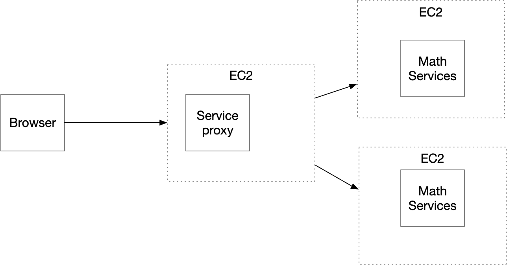
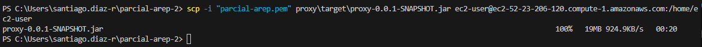
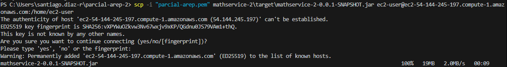
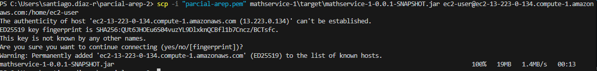
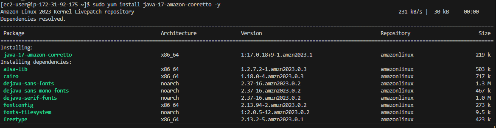
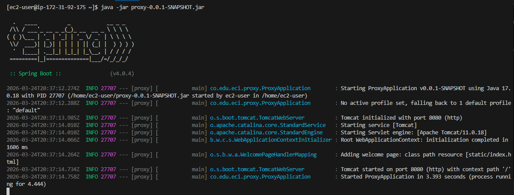
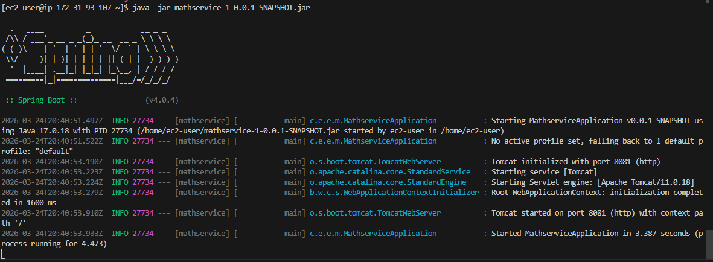
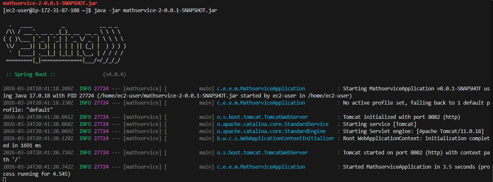

# Parcial AREP 2

En el siguiete repositorio se encuentra el desarrollo completo de la arquitectura propuesta en la imagen, el proyecto esta compuesto por 3 carpetas principales, la primera es el Proxy que implementa un algoritmo de pasivo-activo y quien el es encargado exponer un cliente para posteriormente redirigir segun la actividad de los Math-Services, en este caso cada Math-Service expone un controlador con la resolucion de la conjetura de Collatz para un numero dado, y responden segun la solicitud que hay hecho el Proxy.

## Implementación

1. Como primer ejercicio debemos generar y subir lo .JAR a cada intancia respectivamente:

    * Proxy Server:
        
    * Math Service Server 1:
        
    * Math Service Server 2:
        

2. A continuacion nos conectamos a cada una de las maquinas e instalamos java-17-amazon-corretto, con el comando "sudo yum install java-17-amazon-corretto -y"

3. Por ultimo en cada una de las instancias compilamos el .JAR, con el comando "java -jar [nombre-.jar]"

    * Proxy Server:
        
    * Math Service Server 1:
        
    * Math Service Server 2:
        

4. Por ultimo abrimos los puertos en AWS:

    * Proxy Server: 8080
    * Math Service Server 1: 8081
    * Math Service Server 2: 8082